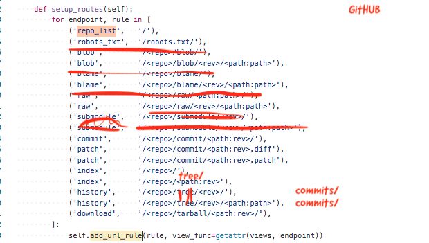

## How to run `klaus-node`

### Step 1:

Clone a few repos in a `repositories/` folder at the root of this repo.

They can be bare clones (`git clone --bare`) or non-bare.

Non-bare (regular repos with a working copy) are convenient for testing as you can create a dummy commit history or tree structure to check that everything works fine.

### Step 2:

Run the node app

```
cd node
npm i
tsc

# run the actual server
node dist/server.js

# or to auto-reload on changes
tsc -w
npm i -g nodemon
./supervisor.sh
```

---

## URL layout

URL layout is different from `klaus` and is actually modeled after GitHub. Here are the schematic differences from klaus.py:



## Helper

We implement a "Check on GitHub" link that opens the "same" page on GitHub (for repos which have a remote there). Peruse it to check that things work the same. 

Notably, the commit history pages. (because libgit2's revwalk is not super properly documented.)

